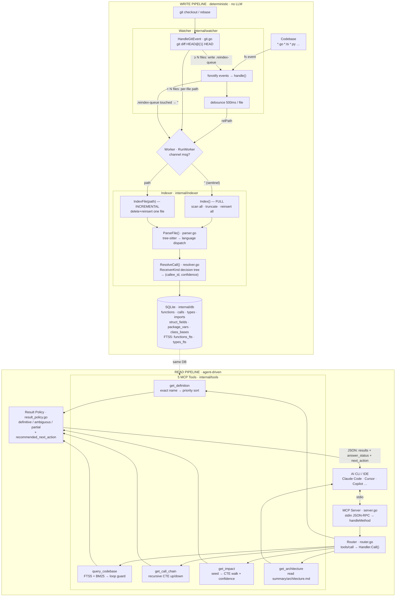
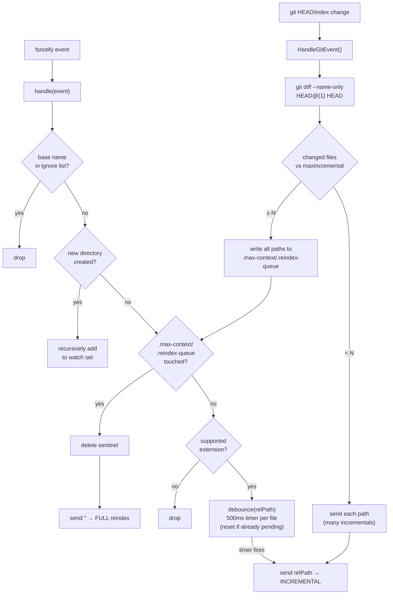
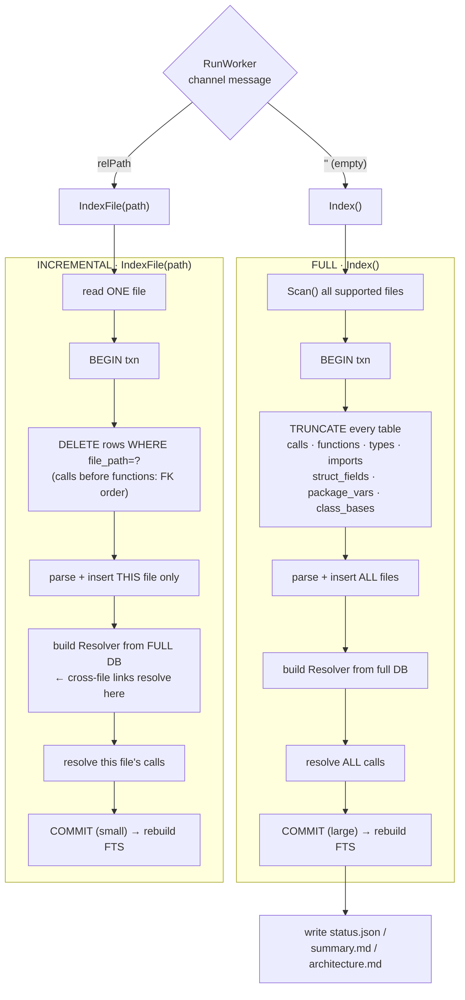
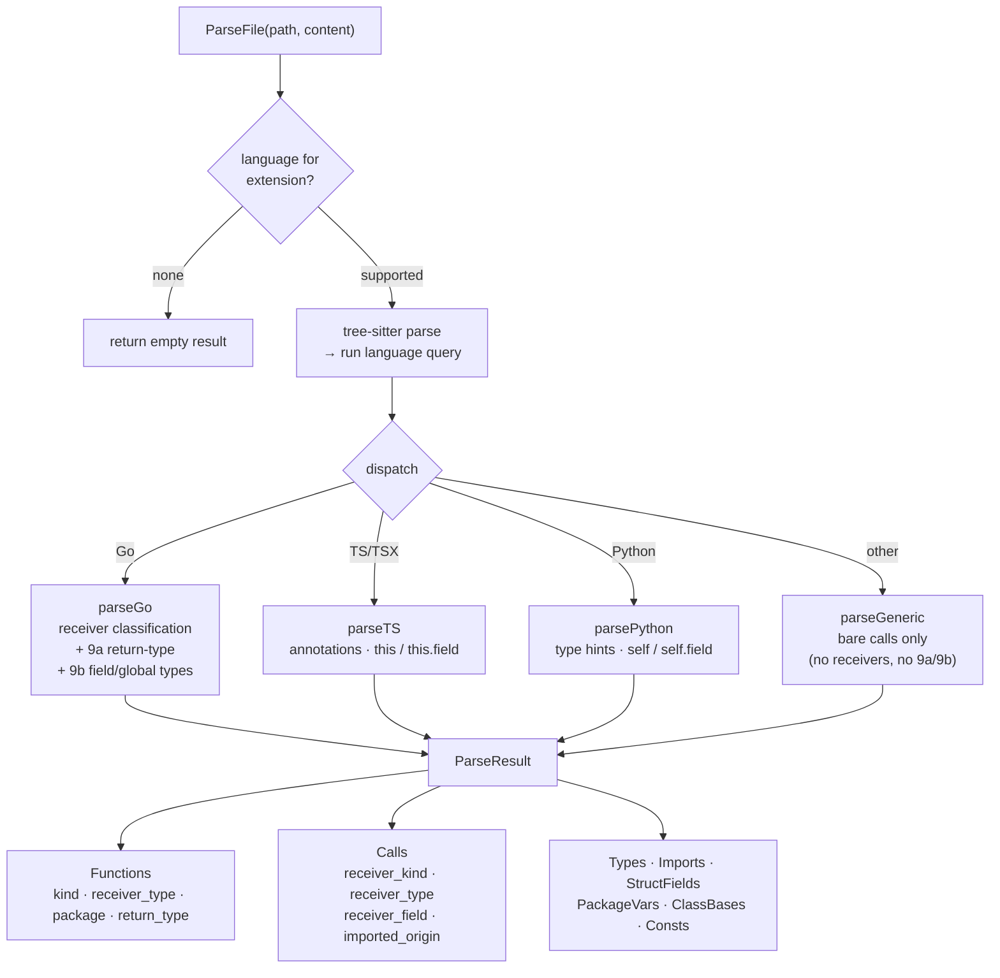
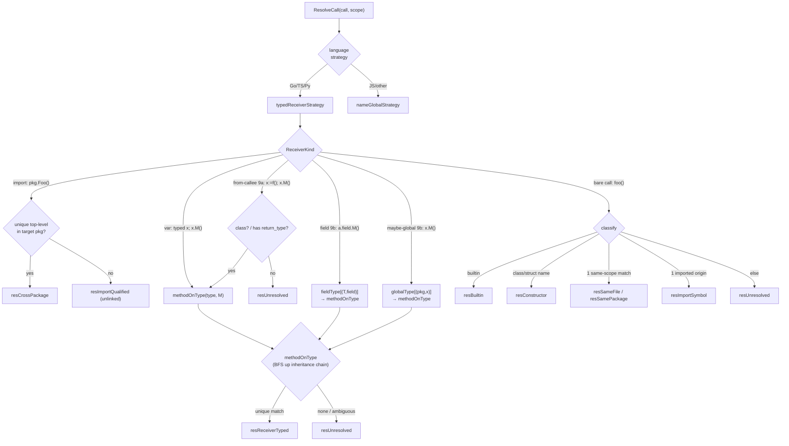
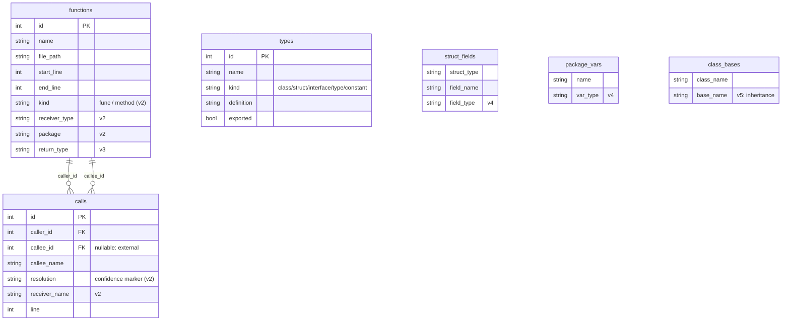
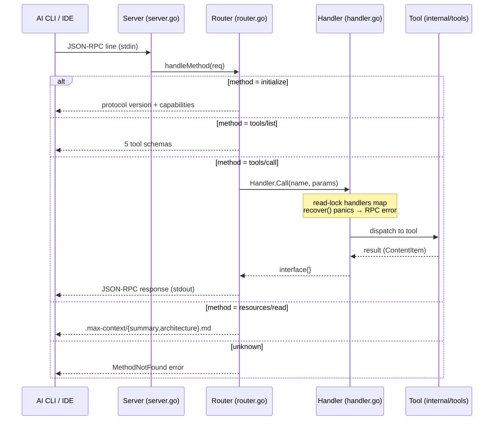
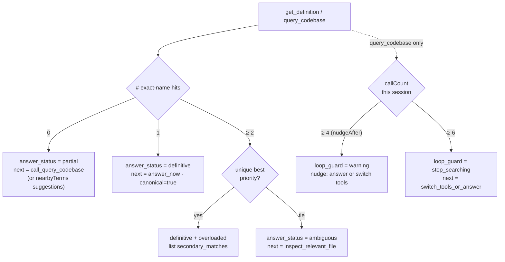
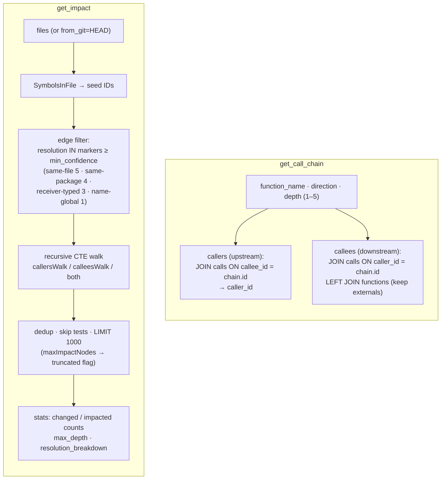

# max-context — Pipeline Architecture

How a file change becomes queryable knowledge, and how an AI agent reads it back.

max-context is two pipelines that meet at a single SQLite database:

- **Write pipeline** (deterministic, no LLM): watcher → parse → resolve → store.
- **Read pipeline** (agent-driven): MCP tool call → SQL/recursive CTE → result policy → JSON verdict.

The database is the seam. That separation is why the project can claim both *"always current"* (the write side runs continuously off OS file events) and *"no token spend at index time"* (the write side never calls a model — the host CLI's model does all reasoning on the read side).

---

## Full pipeline

---

## 1. Watcher — deciding *what* and *how* to reindex

`internal/watcher/watcher.go`, `internal/watcher/git.go`

The watcher converts raw OS events and git operations into exactly one of two signals on the worker channel: a **relative path** (reindex one file) or the **empty string** (reindex everything). The `.reindex-queue` sentinel file is the convergence point — both git bulk-changes and an external `/reindex` command trigger a full rebuild by writing that one file, which the watcher already watches.

**Key behaviors**

- `debounceMs = 500` — rapid saves to the same file collapse into one reindex; the pending-timer map is mutex-protected.
- A fresh clone with no reflog makes `git diff HEAD@{1}` fail; `GitChangedFiles` returns `nil` and is ignored rather than erroring.
- Directory creation is handled live: new sub-trees are added to the watch set recursively, so newly-created folders are covered without a restart.

---

## 2. Worker & Indexer — full vs incremental

`internal/indexer/indexer.go`

`RunWorker` is a single consumer on the channel. The message *is* the branch: `""` → full rebuild (and write status artifacts), any path → incremental.

**The subtle correctness point:** incremental indexing re-parses only one file, but **builds the resolver from the entire database** (`indexer.go:377`). A call in the edited file can therefore still resolve to a definition in an untouched file — cross-file accuracy without re-parsing the world. Deletes run in dependency order (calls before functions) so foreign keys never break mid-transaction.

---

## 3. Parser — tree-sitter, then language dispatch

`internal/indexer/parser.go`

Parsing is deterministic and language-gated. A shared tree-sitter pass produces a query tree; then `ParseFile` dispatches to a typed handler (Go/TS/Python) or falls back to `parseGeneric` for everything else. Only the typed handlers extract the receiver metadata that powers high-confidence call resolution.

**What each typed handler captures**

- **Go** — package + imports (with aliases), funcs/methods with body spans, statically-typed params & locals, `x := f()` bindings (feeds *9a* return-type inference), `base.field.M()` field-receiver calls (feeds *9b*), consts (made searchable), struct fields.
- **TypeScript** — module/named imports with aliases, class bodies & methods, type-annotated params/locals/fields, `this.field.M()` and `this.M()` calls.
- **Python** — `from m import f [as g]` with origin mapping, class defs + base classes, type hints, `self.x = Ctor()` assignments, `self.field.M()` calls.
- **Generic** — legacy capture only; every edge is a bare call with no receiver, so 9a/9b are unavailable.

> *9a* = infer a receiver's type from the **return type** of the function that produced it.
> *9b* = infer a receiver's type from a **struct field** or **package-level variable** declaration.

---

## 4. Resolver — the ReceiverKind decision tree

`internal/indexer/resolver.go`

This is the heart of call-graph accuracy. The resolver first builds scope indexes (`byPkgName`, `byRecvName`, `byTopName`, plus `fieldType`/`globalType`/`bases` maps), then dispatches each call on the `ReceiverKind` the parser attached. Every outcome carries a **confidence marker** that is stored in `calls.resolution` and reused later as a query filter.

**Two "refuse to guess" stances built in:**

- `loadFieldTypes` / `loadGlobalTypes` **delete conflicted entries** — if a field or var name maps to more than one type across files, it's dropped rather than linked. An honest `resUnresolved` beats a wrong edge.
- `methodOnType` does a **breadth-first walk up `class_bases`**, so a method call resolves to a base-class definition when the subclass doesn't define it — but only on an *unambiguous* single match.

**Confidence markers** (stored in `calls.resolution`, highest trust first): `resSameFile` · `resSamePackage` · `resImportSymbol` · `resReceiverTyped` · `resCrossPackage` · `resImportQualified` · `resBuiltin` · `resConstructor` · `resNameGlobal` · `resUnresolved`.

---

## 5. Database — schema & FTS

`internal/db/schema.go`, `internal/db/queries.go`, `internal/db/fts.go`

A versioned migration system (v1–v5, idempotent via `_meta`) builds the relational core plus two FTS5 virtual tables that use *external content* — they index directly from the base tables and are rebuilt after every index pass.

- `functions_fts(name, file_path, code, docstring)` and `types_fts(name, file_path, definition)` are FTS5 external-content tables, queried with `MATCH` + BM25 ranking + `snippet()`.
- Indexes on `calls.resolution`, `calls.caller_id`, `calls.callee_id` make the recursive call-graph walks and confidence filtering cheap.

---

## 6. MCP server & routing

`internal/mcp/server.go`, `router.go`, `handler.go`

A line-oriented JSON-RPC 2.0 loop over stdio. The router maps method names to handlers; tool panics are caught and converted to RPC errors so a single bad call can't crash the server.

---

## 7. Tools & result policy — decisive answers

`internal/tools/*.go`, `internal/tools/result_policy.go`

Every tool returns more than rows: it returns a **verdict** (`answer_status`) and a **routing instruction** (`recommended_next_action`). That's what makes the surface "decisive" — it steers the agent's control flow instead of dumping data.

### get_definition & query_codebase — canonicalization

Both reuse the same priority rule (`type/class > function > method`). A single exact-name hit short-circuits to `definitive`, so fuzzy search degrades gracefully into exact lookup.

**The loop guard** is an anti-pattern detector aimed at the *agent*, not the code: `query_codebase` counts calls per session and, after `nudgeAfter = 4`, pushes the model to commit to an answer or switch to `get_impact`/`get_call_chain`; at `≥ 6` it escalates to `stop_searching`. `query_codebase` also normalizes `max_results` to `[1, 50]` (default 3) and runs a `nearbyTerms` prefix-LIKE fallback when FTS returns zero rows.

### get_call_chain & get_impact — recursive CTE walks

Both share one recursive-CTE shape and flip only the join direction. `get_impact` adds seed extraction, confidence filtering, and a hard node cap.

- **`get_call_chain`** clamps depth to `[1, 5]` (default 2); downstream uses `LEFT JOIN` so external/unresolved callees survive via `callee_name`.
- **`get_impact`** turns changed *files* into seed *symbols*, walks the graph, and reuses the `calls.resolution` markers as a `min_confidence` filter — the same confidence computed once at index time, spent again at query time. Results are capped at `maxImpactNodes = 1000` with a `truncated` flag, and test files are excluded unless `include_tests=true`.

### get_architecture

Reads pre-computed `.max-context/summary.md` and `architecture.md` and returns them concatenated — no query, just the artifacts written during the last full index.

---

## Cross-cutting design notes

- **Confidence is a first-class column, not a runtime heuristic.** Computed once during resolution, stored in `calls.resolution`, and reused as a query-time filter in `get_impact`. One concept, two payoffs.
- **One sentinel, many triggers.** Git bulk-changes and external `/reindex` both converge on writing `.max-context/.reindex-queue`, which the watcher already watches — a single "full rebuild" path.
- **The tools steer the agent.** `answer_status` + `recommended_next_action` + the loop guard are designed to shape the host model's behavior, turning a search API into a decision API.
- **Refuse to guess.** Conflicted field/global types are deleted; ambiguous matches return `ambiguous` rather than a wrong pick. The system prefers an honest "don't know" over a confident error.
